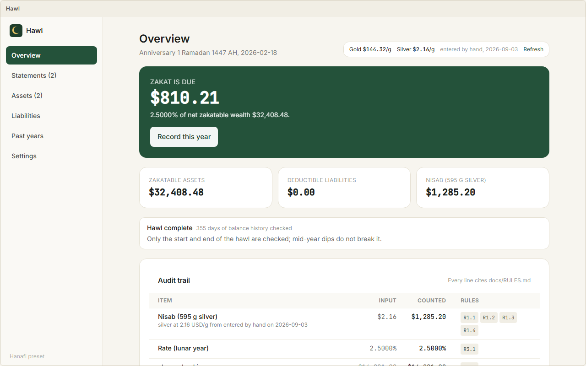
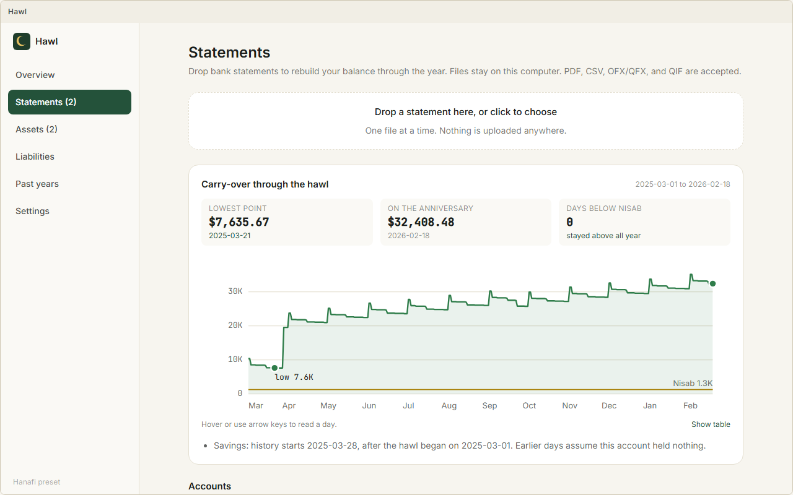

<div align="center">
  
  <h1>Hawl</h1>
  <p>A local-first zakat calculator for Windows and macOS.</p>
  <p>
    <a href="https://github.com/kareemshama/hawl/releases"></a>
    
    
    
  </p>
</div>

Hawl imports your bank statements, rebuilds your balance across the lunar year, and tells you
whether zakat is due and how much. Every line of the result cites the rule it applied, and every
rule is written down with its sources in [docs/RULES.md](docs/RULES.md).

*Hawl* (حول) is the lunar year wealth must be held before zakat falls due.

## What it does

- **Reads statements.** PDF, CSV, OFX/QFX, and QIF, a whole year of files at once. Column layouts
  are detected automatically and every row is cross-checked against the running balance. The same
  transaction from two files is counted once.
- **Reads awkward PDFs with local AI.** Statements laid out in sections without a running balance
  are read by a small model that runs on your computer (llama.cpp, one-time 2 GB download from
  Settings). Its rows go through the same review and balance checks as everything else.
- **Shows what you carried through the year.** A daily balance across all accounts from the start
  of the hawl to the anniversary, the lowest point, the balance on the anniversary, and whether the
  total ever dipped below nisab.
- **Applies the school of law you follow.** Hanafi, Shafi'i, Maliki, and Hanbali presets, with every
  position adjustable on its own: nisab metal, how dips are treated, jewellery, long-term debt,
  retirement accounts, and more.
- **Values what statements cannot see.** Gold and silver by weight and purity, stocks, crypto,
  retirement accounts, business assets, money owed to you, property held for resale.
- **Explains itself.** The audit trail lists each asset and liability, what entered the
  calculation, and the rule numbers behind it.
- **Reconstructs missed years.** Values past anniversaries from statement history and carries
  unpaid zakat forward as a debt.
- **Keeps your data on your computer.** Everything you enter is saved in one file in your app
  data folder and nowhere else, and Settings has a button to delete it. The only network requests
  are the gold and silver price, which you can enter by hand instead, and the optional one-time
  AI download.

<p align="center">
  
</p>
<p align="center">
  
</p>

## Install

Download the installer for your platform from the
[releases page](https://github.com/kareemshama/hawl/releases).

- **Windows:** run the `.msi` or the `.exe` setup.
- **macOS:** open the `.dmg` and drag Hawl to Applications. The build is not notarized yet, so the
  first time you open it right-click the app and choose **Open**.

## How the calculation works

Zakat is a snapshot of wealth on the anniversary, not a tax on income. Hawl adds up zakatable
assets on that date, subtracts deductible liabilities, and compares the result with nisab, the
value of 595 g of silver or 85 g of gold at that day's price. If net wealth is at or above nisab
and has been held for a full lunar year, zakat is 2.5 percent of it.

The positions Hawl implements, with citations, are in [docs/RULES.md](docs/RULES.md). Where the
schools of law differ, the app lets you choose and says which position it used. Hawl is a
calculation aid, not a fatwa. For an unusual situation, ask a scholar and adjust the inputs.

## Development

Requirements: Node 22, Rust stable, and the
[Tauri prerequisites](https://v2.tauri.app/start/prerequisites/) for your platform.

```
npm install
npm run dev            # desktop app in dev mode
npm run web            # UI only, in a browser at http://localhost:1421 with a mock backend
npm test               # rules engine and statement parser tests
npm run typecheck
npm run build:desktop  # installers
```

The repository is a workspace:

| Path | What it is |
|---|---|
| `packages/zakat-engine` | The rules engine. Pure TypeScript, one test per rule. |
| `packages/statements` | Statement parsing, running-balance verification, daily balance series. |
| `packages/core-types` | Shared types. |
| `apps/desktop` | Tauri 2 app: React front end, Rust for the store, prices, and Hijri dates. |
| `docs/RULES.md` | Every rule the engine applies, with sources. |
| `docs/SPEC.md` | Product and architecture spec, milestones, open decisions. |

Releases are built by GitHub Actions from a `v*` tag for Windows and macOS.

## License

MIT. See [LICENSE](LICENSE).
